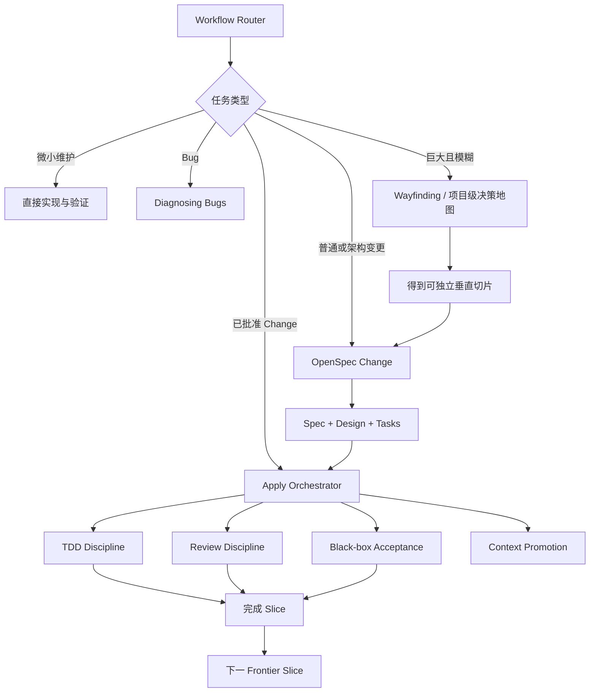

# GPT-5.6 的完整回答

## 摘要

本文件是 **2026-07-25 会话 B** 里 **GPT-5.6** 的全部回答，共 **21 条**、约 **31195 字**。
用途：对比 **GPT 与 Claude 的中文表达差异**，给 output-style skill 提取写作规则。

- **话题**：OpenSpec 精简、artifact 取舍、skill 原子化
- **同题对比**：两个模型回答同一问题的段落见 `同题对比.md`
- **跳读方法**：看下面的主题目录，跳到需要的小节

## 主题目录

- 第 1 条 · 先看 mattpocock/skills 的真实结构与理念，再对照你仓库现有资产，给出值（92 字）
- 第 2 条 · 不建议照搬这套 skills；最值得借鉴的是它的“分层与减重”，不是具体命令（1213 字）
- 第 3 条 · 目标不是重新设计一套 workflow，而是做一次上游版本差异调查（102 字）
- 第 4 条 · 你已经吸收了其中不少思想，但把它们整合进了更严格的 OpenSpec Gate 流程（11906 字）
- 第 5 条 · OpenSpec 的 artifact dependency 是否妨碍 skill 原子（134 字）
- 第 6 条 · OpenSpec 到底是什么（7794 字）
- 第 7 条 · 保留 OpenSpec 作为唯一 change 状态骨架，但把执行纪律、GitHub、w（180 字）
- 第 8 条 · 需要比较几种 artifact 依赖图，用图会比纯文字清楚（89 字）
- 第 9 条 · 图里把当前 6 个主 artifacts、条件 execution-plan、apply（199 字）
- 第 10 条 · OpenSpec 不再承担“长期产品规格库”的首要职责（336 字）
- 第 11 条 · 我会先核对 OpenSpec 官方对 change 粒度、拆分时机和大型需求处理方式的原（166 字）
- 第 12 条 · 如果 scope 像多个 feature 的列表、两个人无法无冲突地协作、或一半 tas（949 字）
- 第 13 条 · Child Issues（每个对应一个 OpenSpec change）（342 字）
- 第 14 条 · 保留 delta specs 后，OpenSpec 的价值链完整了（239 字）
- 第 15 条 · 这会把 design.md 从当前约 90 行的审批表，缩成一个接手者真正需要的技术 h（229 字）
- 第 16 条 · 刚才的三个选项仍然在试图为所有情况预先规定模式，这和 OpenSpec 的 enable（563 字）
- 第 17 条 · 实施模式变成一次 apply invocation 的交互选择，不再是 planning（301 字）
- 第 18 条 · OpenSpec artifacts（347 字）
- 第 19 条 · 架构收缩设计（134 字）
- 第 20 条 · 一、当前为什么显得重（5754 字）
- 第 21 条 · “极简 OpenSpec A 方案”的设计讨论（126 字）

---

# 第 1 条 · 先看 mattpocock/skills 的真实结构与理念，再对照你仓库现有资产，给出值

> 会话索引 1 ｜ 2026-07-25T10:36:43 ｜ 92 字

我把这理解为一次中等复杂度的 workflow 对标讨论：先看 `mattpocock/skills` 的真实结构与理念，再对照你仓库现有资产，给出值得借鉴、应避免、以及最小演进路径。

---

# 第 2 条 · 不建议照搬这套 skills；最值得借鉴的是它的“分层与减重”，不是具体命令

> 会话索引 22 ｜ 2026-07-25T10:38:03 ｜ 1213 字

先给你一个初步判断：**不建议照搬这套 skills；最值得借鉴的是它的“分层与减重”，不是具体命令。**

你现在的体系偏“强治理”：

- OpenSpec 五个 Gate
- proposal / review / spec / design / implementation-mode / tasks / execution-plan
- Issue / PR 状态同步
- apply ledger、task brief、双 review、black-box acceptance、memory promotion

优点是边界严、适合高风险改动；代价是普通变更也容易进入一条很长的流水线。

Matt 这套的核心差异：

1. **编排 skill 与纪律 skill 分开**
   - 人手触发：`grill-with-docs`、`to-spec`、`to-tickets`、`implement`
   - 模型自动触发：`tdd`、`diagnosing-bugs`、`domain-modeling`、`code-review`
   - 编排层很薄，工程纪律可以复用。

2. **先形成统一语言，再写规格**
   - `grill-with-docs` 在讨论时就维护 `CONTEXT.md` 和 ADR。
   - 你目前更多是在开工前读取、收尾时 promotion；中间设计对话与长期上下文连接得没那么紧。

3. **用 tracer-bullet ticket graph 表达实施计划**
   - 每张 ticket 都是可独立验证的垂直切片，并显式声明 blocker。
   - 你已有“垂直切片 + execution-plan”，但目前更像 change 内部 artifact；没有把依赖图提升为一等工作对象。

4. **刻意保持实施入口极薄**
   - 他的 `implement` 基本只做：按 spec/ticket 实现 → TDD → review → commit。
   - 你的 `ai-solo-apply-execution` 很完整，但也承担了太多职责，维护成本和上下文负担都高。

5. **skill 本身有明确的减熵方法**
   - completion criterion
   - progressive disclosure
   - single source of truth
   - no-op pruning
   - user-invoked / model-invoked 的触发成本区分

我目前最想建议的方向是：**保留 OpenSpec 作为“重流程”，另加一条普通任务的轻量路径；同时把 apply 拆成薄编排 + 可复用纪律 skills。** 这样不是推翻现有体系，而是解决“所有改动都走重流程”的摩擦。

---

# 第 3 条 · 目标不是重新设计一套 workflow，而是做一次上游版本差异调查

> 会话索引 25 ｜ 2026-07-25T10:43:28 ｜ 102 字

明白了。目标不是重新设计一套 workflow，而是做一次**上游版本差异调查**：定位你当前体系大致基于 Matt 的哪个阶段，梳理他最近新增、重写、删除了什么，再判断哪些变化适合迁移。视觉辅助不需要。

---

# 第 4 条 · 你已经吸收了其中不少思想，但把它们整合进了更严格的 OpenSpec Gate 流程

> 会话索引 56 ｜ 2026-07-25T10:47:20 ｜ 11906 字

## 结论

你看到的“最近更新”其实分成三层：

1. **已发布：v1.1.0**
2. **已合并到 `main`、但尚未正式发版的增量**
3. **仍在 draft PR 中的 v1.2 / 下一阶段实验**

你当前仓库始建于 **2026-07-04**，主要改造集中在 7 月 5–7 日；Matt 的 v1.1 改造也正好发生在 7 月 6–8 日。因此：

> [INFERENCE] 你的 workflow 大致来自 Matt v1.0 后期到 v1.1 形成期，不是一个能精确对应的 release 快照。你已经吸收了其中不少思想，但把它们整合进了更严格的 OpenSpec Gate 流程。

当前上游 `package.json` 仍是 **1.1.0**；[v1.2 release PR](https://github.com/mattpocock/skills/pull/593) 仍是 draft，不能把所有新变化都当成稳定设计。

---

# 一、v1.1 最核心的变化

来源：[CHANGELOG](https://github.com/mattpocock/skills/blob/main/CHANGELOG.md)、[v1.1 PR #464](https://github.com/mattpocock/skills/pull/464)。

## 1. 规划链路统一成 `idea → spec → tickets → implement`

旧流程：

```text
to-prd
to-plan
to-issues
```

新流程：

```text
grill-with-docs
    ↓
to-spec
    ↓
to-tickets
    ↓
implement
```

具体变化：

- `to-prd` 改名为 `to-spec`
- `to-plan` 与 `to-issues` 合并为 `to-tickets`
- `to-tickets` 同时接受 conversation、plan、spec
- 每张 ticket 都必须声明 blocking edges
- 无 blocker 的 ticket 构成当前 frontier
- 每张 ticket 是一个可独立验证的 tracer-bullet vertical slice
- 每张 ticket应能放进一个新的 context window 独立实现

你的 workflow 已经有：

- 垂直切片
- `Blocked By` / `Blocks`
- Work Unit
- 并行条件
- execution plan

但有个明显差异：

> 你只在“多子代理 execution-plan”里把依赖图当一等对象；Matt 把 blocking edges 下沉到了所有普通 ticket。

### 值得迁移

让 `tasks.md` 中的每个垂直切片也具备：

```md
- Blocked By:
- Blocks:
- Frontier Status:
- 独立验收入口:
- 建议 context 边界:
```

这样即使是单 Agent，也可以明确“下一张可执行切片”，而不是只有多 Agent 模式才有依赖图。

---

## 2. 区分“编排 Skill”和“纪律 Skill”

Matt 现在把 skills 分为：

### User-invoked：负责流程编排

- `ask-matt`
- `grill-with-docs`
- `to-spec`
- `to-tickets`
- `implement`
- `wayfinder`

### Model-invoked：负责可复用工程纪律

- `grilling`
- `domain-modeling`
- `tdd`
- `diagnosing-bugs`
- `code-review`
- `codebase-design`
- `prototype`
- `research`

原则是：

> User-invoked skill 负责“接下来走哪条路”；model-invoked skill 负责“这一步应该遵守什么专业纪律”。

你的 `ai-solo-apply-execution` 同时承担了：

- 执行入口
- 模式选择
- Task Brief
- 子代理协议
- Memory Authority
- TDD
- Review
- Severity
- Retry
- Black-box acceptance
- Memory promotion

这使它很完整，但也造成三个问题：

1. 很多规则不能被其他流程单独复用。
2. 单次加载时上下文较重。
3. TDD、review 等规则可能与全局已有 skill 产生双重权威。

### 值得迁移

把 `ai-solo-apply-execution` 定位成**薄编排器**：

```text
读取 artifacts
  ↓
选择 frontier slice
  ↓
调用 TDD 纪律
  ↓
调用 review 纪律
  ↓
调用 acceptance 纪律
  ↓
更新 ledger / GitHub / memory
```

不一定马上新增四五个 skill，但至少应该逐步把下面这些内容移出 apply 主文件：

- 测试设计与 TDD 规则
- review 规则
- black-box acceptance 规则
- domain/context promotion 规则

apply 只保留：

- 什么时候调用
- 调用顺序
- Gate
- 状态转换
- 失败回退

这是我认为**最值得迁移的一项架构变化**。

---

## 3. TDD 从流程改为参考纪律

上游现在的 [`tdd`](https://github.com/mattpocock/skills/blob/main/skills/engineering/tdd/SKILL.md) 不再是一条很长的执行流程，而是一个 reference-only skill，核心只有：

- 在约定好的 seam 上测试
- 测公共行为，不测实现细节
- red before green
- 每次一个 vertical slice
- 禁止 tautological test
- 禁止 horizontal slicing
- refactor 移交给 code review

其中两个很有价值的新概念：

### Seam 必须预先确认

不是“尽可能多地测试”，而是先明确：

> 哪个公共边界是行为的权威观察点？

Matt 甚至要求在写测试前与用户确认 seam。

你当前更强调 Gherkin 场景和真实用户表面，但“测试落在哪个公共 seam”还没有被提升为明确 artifact。

我建议在 `design.md` 或 `tasks.md` 增加：

```md
## 测试 Seam

- Seam:
- 为什么这是最高可用边界:
- 可观察结果:
- 不通过哪些内部状态验证:
```

### Tautological Test

上游明确反对：

```ts
expect(add(a, b)).toBe(a + b)
```

因为测试用与生产代码相同的方法重新计算期望值，二者天然一致。

你已有“不要检查可伪造中间状态”，但可以补一个更准确的判断：

> Expected value 必须来自独立 source of truth：spec、已知 literal、业务示例或外部 oracle。

### 不建议照搬的地方

Matt 把 refactor 完全移出了 TDD loop，变成：

```text
red → green
review → refactor
```

而你当前是：

```text
red → verify-red → green → verify-green → refactor
```

我不建议机械跟随上游。

你的规则已经限制：

> 只清理本轮引入的复杂度。

这个局部 refactor 很合理。可以继续保留，同时明确：

- TDD 内：只做本轮局部清理
- Code Review：处理跨 slice 的结构问题、smell、深模块问题

这样比完全推迟 refactor 更稳。

---

## 4. Code Review 被拆成两个互不污染的轴

上游 [`code-review`](https://github.com/mattpocock/skills/blob/main/skills/engineering/code-review/SKILL.md) 将 review 分成：

### Standards

是否符合：

- 仓库规范
- Fowler smell baseline
- 可维护性原则

### Spec

是否：

- 漏掉需求
- 部分实现
- 实现了未要求的行为
- 看似完成但行为错误

两个 review 由独立子代理并行执行，最后并排呈现，**不统一重排优先级**。

你的 apply 已经有：

- Spec Compliance Review
- Code Quality Review

所以概念上已经对齐。

### 值得迁移的细节

1. 两个 reviewer 的上下文应严格隔离。
2. Standards reviewer 不应读取 spec 后替 Agent 合理化范围漂移。
3. Spec reviewer 不应因为代码“写得漂亮”而放过行为缺失。
4. 两条轴分别给结论，不合并成一个模糊的“通过/不通过”。

你当前 review package 可以进一步明确：

```md
## Spec Reviewer 可读范围
- spec
- acceptance
- diff

## Standards Reviewer 可读范围
- repo rules
- coding standards
- diff

## 禁止交叉输入
```

---

# 二、7 月 8 日后合并到 `main` 的更新

这些不一定都已作为正式 release 发布。

## 1. Setup 更少打扰用户

[`setup-matt-pocock-skills`](https://github.com/mattpocock/skills/blob/main/skills/engineering/setup-matt-pocock-skills/SKILL.md) 的新版本做了明显减法：

- 只有安装了 `triage`，才询问 triage labels
- 默认单 context，不询问
- 只有检测到 monorepo 信号，才提供 multi-context
- PR 作为 request surface 默认关闭，不再主动打扰
- local tracker 改为“一张 ticket 一个文件”，而不是一个总 `tickets.md`
- 问题前先给推荐答案，用户可以一句话接受

这与 Matt 最近反复强调的规则一致：

> 只询问会改变当前写入结果的决策。

你的 `project-init-workflow` 已经有“Ask only for choices that affect files you will write now”，方向正确。

### 可继续补齐

- 先探测已安装 skills，再决定问哪些配置。
- 自动检测 monorepo，再决定是否出现 multi-context 选项。
- 不使用 GitHub 时，不询问 labels / PR policy。
- 不使用 OpenSpec 时，不生成 OpenSpec 相关入口。
- 默认值能安全推导时，直接采用并说明，不形成一次用户中断。

---

## 2. `ask-matt` 成为真正的 Router

当前 [`ask-matt`](https://github.com/mattpocock/skills/blob/main/skills/engineering/ask-matt/SKILL.md) 已不只是 skill 索引，而是显式描述：

### Main flow

```text
idea
  → grill-with-docs
  → prototype（可选）
  → to-spec
  → to-tickets
  → implement
```

### On-ramps

```text
已有 bug          → diagnosing-bugs
积压外部 Issue    → triage
巨大而模糊的工作  → wayfinder
代码库维护        → improve-codebase-architecture
```

### Context hygiene

- grilling 到 `to-tickets` 尽量留在一个连续 context
- 每张 implementation ticket 使用全新 context
- 需要跨 session 时使用 handoff
- 不在中间任意 compact

你的仓库目前缺少这样一个**面向使用者的总路由入口**。README 说明了安装什么，却没有回答：

> “我现在遇到的是 bug、普通 feature、架构变更还是一个巨大模糊项目，应该从哪个 skill 开始？”

### 建议

后续可以增加一个类似 `workflow-router` 的 user-invoked skill，内容不复制各 skill 细节，只描述：

```text
微小维护 → 直接实现 / 最小验证
普通变更 → OpenSpec 垂直切片
架构变更 → OpenSpec + C4/domain/ADR
难复现 bug → diagnosis loop
巨大模糊项目 → project-level discovery，先不进入 OpenSpec
已有 approved change → ai-solo-apply-execution
GitHub 操作 → github-project-flow
```

它应该是导航，不是新的总控大 skill。

---

## 3. Wayfinder 被重新定义为“决策地图”

当前 [`wayfinder`](https://github.com/mattpocock/skills/blob/main/skills/engineering/wayfinder/SKILL.md) 的核心已经不是一般计划，而是：

> 为超过一个 context window 的巨大、模糊工作建立一张 decision map。

关键概念：

- Destination：最终要弄清楚什么
- Fog of war：目前知道将来要讨论，但还无法精确定义的区域
- Frontier：现在已可处理、无 blocker 的 decision tickets
- Decision ticket：解决一个决策，不交付一段产品
- Map is an index, not a store
- 一次 session 只解决一张非 research ticket
- Research ticket 可交给后台子代理并行处理
- 没有 fog 时提前退出，不滥建 map

### 与你的 OpenSpec 边界非常契合

你的规则明确：

> 项目级描述、整体愿景和跨多个切片的大范围需求放在 OpenSpec 外部。

Wayfinder 正好适合放在 OpenSpec 之前：

```text
巨大模糊项目
  ↓
项目级 decision map
  ↓
逐步消除 fog
  ↓
得到可构建的垂直切片
  ↓
每个切片分别进入 OpenSpec
```

### 不建议的做法

不要把完整 Wayfinder 塞进 `ai-solo-workflow` schema。

原因：

- Wayfinder ticket 是“决策”
- OpenSpec task 是“实现”
- 两者生命周期、验收标准、完成条件不同

可以借它的术语和边界，但保持两个系统独立。

---

## 4. 跨 Harness 支持

近期还新增了：

- 原生 Claude Code plugin：[PR #536](https://github.com/mattpocock/skills/pull/536)
- 每个 skill 增加 Codex `agents/openai.yaml` metadata：[PR #551](https://github.com/mattpocock/skills/pull/551)

这主要是**分发和调用元数据**变化，不是工程 workflow 核心变化。

你的仓库通过 `bunx skills` 分发给 OpenCode，目前没必要跟进 Claude plugin。除非你计划同时维护 Claude Code/Codex 使用者，否则优先级很低。

---

# 三、v1.2 draft 中的新理念

## 1. Grilling 改为“按 Frontier 分轮批量问”

[v1.2 PR #593](https://github.com/mattpocock/skills/pull/593) 的 headline change：

旧版：

```text
每次问一个问题
回答后再问下一个
```

新版 draft：

```text
先构建 decision tree
  ↓
找出当前 frontier
  ↓
一轮同时问完 frontier 上所有独立问题
  ↓
用户统一回答
  ↓
重新计算 frontier
```

事实调查同时交给后台 subagents，不阻塞其他独立问题。

目标是把大约 13 个问题从 13 轮减少到约 3 轮。

### 这个改动有真实争议

PR review 和评论提出了合理风险：

- 看似独立的问题，可能在用户回答后发现实际耦合。
- 批量问题对不熟悉问题的用户认知负担较高。
- 单问题模式更像自然对话，容易及时纠偏。
- 批量模式适合用户已有较清晰方案、只是做 pressure test。
- 一次一个问题适合用户自己也尚未想清楚的情况。

所以这还不是一个可以直接照搬的稳定结论。

### 我建议你的迁移方式

做成**自适应策略**，不要全局替换：

| 场景 | 建议模式 |
|---|---|
| 意图模糊、用户尚未形成方案 | 一次一个问题 |
| 方案较成熟，只需 pressure test | Frontier 批量 |
| 问题间依赖强 | 一次一个问题 |
| 多个问题明确独立 | 同轮批量 |
| 需要事实调查 | 后台调查，不问用户 |
| 高风险架构决策 | 单独确认关键决策 |

你的 schema 目前要求“一次只问一个真正影响决策的问题”。这条不必删除，可以扩展为：

> 默认一次一个；只有当前 frontier 的问题已确认彼此独立，且用户已有明确方向时，才允许同轮编号提问。

---

## 2. Logic Prototype 从 TUI 改成单文件 HTML

v1.2 draft 将逻辑原型从 terminal app 改为：

```text
单个 self-contained HTML
纯 HTML/CSS/JS
双击即可运行
按钮驱动状态变化
展示完整状态
包含 guided walkthrough
面向非技术领域专家
```

对应变更见 [PR #593 prototype diff](https://github.com/mattpocock/skills/pull/593/files)。

这个思路很好，特别适合：

- 状态机
- 审批流
- 订单生命周期
- 权限规则
- 复杂表单状态
- 业务规则的边界场景
- 需要 PM、设计师或领域专家共同验证

但它更像一个可选的 discovery 工具，不应进入每个 OpenSpec change 的必经流程。

建议定位：

> 当 design question 不能可靠地靠文字解决时，允许先做 disposable prototype；原型回答问题，不能直接演变成 production scaffold。

---

# 四、仍在实验、暂时不要迁移的内容

## 1. `writing-great-skills → writing-for-agents`

[PR #650](https://github.com/mattpocock/skills/pull/650) 仍是 draft。

方向很值得关注：

- 从“如何写 skill”推广为“如何写任何 Agent 消费的文档”
- 同时覆盖：
  - `SKILL.md`
  - `AGENTS.md`
  - `CLAUDE.md`
  - 被 pointer 引用的 agent docs
- 强调：
  - single source of truth
  - progressive disclosure
  - completion criterion
  - context pointer
  - no-op pruning
  - leading word
  - duplication / sediment / sprawl
- 将 invocation mechanics 拆到独立 reference
- 打算变为 model-invoked，让 Agent 在编辑规范文件时自动应用

这个理念非常适合你的仓库，因为你维护的几乎全是“Agent 消费的文档”。

但 PR review 已发现 metadata 与 invocation 配置不一致，因此暂时不要按其目录结构原样迁移。

### 可以先吸收的方法论

以后审查每个 skill 时问：

1. 每一步是否有可检查的 completion criterion？
2. 这句话如果删除，Agent 行为会改变吗？不会就是 no-op。
3. 同一个规则是否在 schema、skill、AGENTS、模板里重复？
4. 所有分支都需要这段内容吗？否则应 progressive disclosure。
5. 禁止式语言能否改写成正向目标？
6. skill 是太长，还是实际上承担了多个 invocation branch？

这套检查对你当前的 `ai-solo-apply-execution` 特别有价值。

## 2. 通用 `spawn`

[PR #647](https://github.com/mattpocock/skills/pull/647) 尝试把 Claude handoff 泛化成跨 Claude、Codex、Pi、Cursor、OpenCode、Copilot 的后台 Agent 启动器。

Matt 已明确评论：

> Closing — rethinking whether a generic spawn skill makes sense.

因此不建议迁移。

你当前 harness 已经有自己的 subagent、task、hub 和 handoff 机制。再加一层通用 shell spawn 只会制造第二套进程管理协议。

---

# 五、对你这套 workflow 的具体迁移建议

## 第一优先级：直接吸收

### 1. 建立 Router

新增一个很薄的 workflow 路由入口，明确：

```text
bug / feature / architecture / huge foggy project / approved change
```

分别进入哪条流程。

### 2. 把 blocking graph 下沉到普通 tasks

不要只让多 Agent `execution-plan.md` 有依赖图。普通单 Agent slice 也应有 blocker/frontier。

### 3. 将 apply 拆成“薄编排 + 独立纪律”

优先拆分或外部引用：

- TDD
- Code Review
- Black-box Acceptance
- Domain/Memory Promotion

### 4. 把 domain modeling 从“收尾沉淀”前移到“设计对话中即时维护”

你的 `project-context-docs` 已经有良好的存放边界，但更偏：

```text
读已有内容
任务结束后判断是否 promotion
```

建议补上 Matt 的 active discipline：

- 术语冲突时立即指出
- 模糊词立即澄清
- 用边界场景 stress-test
- 与代码语义冲突时立即暴露
- 术语稳定后立即更新 `CONTEXT.md`
- ADR 仍保持严格 Gate

### 5. 在 design/tasks 中明确 Test Seam

将“真实用户表面”进一步具体化成预先确认的公共 seam。

### 6. 建立 Agent 文档自身的质量检查

用下面五项审查 schema、skills、AGENTS 和模板：

- completion criterion
- single source of truth
- progressive disclosure
- no-op pruning
- positive steering

---

## 第二优先级：试运行后决定

### 1. 自适应 Grilling

先不要修改全局默认。可以增加：

- `逐问模式`
- `frontier 批量模式`

再根据使用反馈决定默认值。

### 2. Shareable HTML Prototype

适合复杂状态与领域流程；作为 design 的可选分支，不作为 Gate。

### 3. 双轴 Review 的更严格上下文隔离

你的概念已有，只需强化 reviewer 输入边界。

---

## 暂不迁移

- Claude plugin 打包
- Codex metadata
- 通用 spawn
- 完整 Wayfinder 嵌入 OpenSpec
- 完全取消 TDD 内的局部 refactor
- 未定稿的 `writing-for-agents` 文件结构

---

# 我建议的最终演进形态



一句话概括：

> 保留你现有 OpenSpec 的强 Gate，但借 Matt 的新方向把 workflow 变成“Router 选择路径、薄编排推进状态、独立纪律保证质量、ticket graph 暴露 frontier”，而不是继续把所有规则加进一个越来越长的 apply skill。

这会保留你体系的可靠性，同时明显降低重复、上下文负担和维护成本。

---

# 第 5 条 · OpenSpec 的 artifact dependency 是否妨碍 skill 原子

> 会话索引 58 ｜ 2026-07-25T10:57:31 ｜ 134 字

我把问题拆成两层：**OpenSpec 的 artifact dependency 是否妨碍 skill 原子化**，以及 **你的 workflow 是否已经足以替代 OpenSpec**。先确认 OpenSpec 当前官方定位，再结合你现有 schema 给结论。

---

# 第 6 条 · OpenSpec 到底是什么

> 会话索引 65 ｜ 2026-07-25T10:59:03 ｜ 7794 字

可以，而且这里需要把两个“依赖”分开理解：

- **OpenSpec 的依赖**：artifact 之间的数据依赖。
- **Matt 的原子化**：skill 之间的职责边界。

两者并不冲突。但更关键的是：**OpenSpec 不是必需品。你的 workflow 完全可以不用 OpenSpec，只是要明确由什么东西承担“持久状态和约束检查”。**

---

# 先说 OpenSpec 到底是什么

OpenSpec 不是完整开发 workflow，也不是 Agent 能力库。

它更接近一个：

> **变更级 artifact 状态机 + 依赖图 + 验证与归档工具。**

例如：

```yaml
artifacts:
  - id: proposal
    generates: proposal.md
    requires: []

  - id: specs
    generates: specs/**/*.md
    requires: [proposal]

  - id: design
    generates: design.md
    requires: [specs]

  - id: tasks
    generates: tasks.md
    requires: [design]
```

OpenSpec 负责回答：

- 当前 change 是什么？
- 已有哪些 artifacts？
- 哪个 artifact 已 ready？
- 哪些前置 artifact 还缺失？
- 每个 artifact 应写到哪里？
- 应使用什么模板和 instruction？
- change 是否可以 apply？
- 完成后如何 archive？
- archive 时是否把变更合并进长期 specs？

官方文档对 artifact dependency 的示例见 [OpenSpec Custom Workflow](https://github.com/Fission-AI/OpenSpec/blob/main/docs/opsx.md)，标准流则是：

```text
proposal → specs → design → tasks → implement
    ↑         ↑        ↑                 │
    └─────────┴────────┴─────────────────┘
              update as you learn
```

来源：[OpenSpec Getting Started](https://github.com/Fission-AI/OpenSpec/blob/main/docs/getting-started.md)。

注意最后那个回环：**artifact 的依赖不是“写完后永远冻结”**。它表示生成某个 artifact 前需要哪些信息，不代表后续学习不能反向更新 proposal/spec/design。

---

# OpenSpec 与 workflow 的区别

## Workflow 管行为

你的 skills 主要回答：

- Agent 开始时要探索什么？
- 哪些问题必须问用户？
- 什么时候做领域建模？
- 什么时候创建 Issue？
- 怎样 TDD？
- 怎样派子代理？
- 怎样 review？
- 怎样验收？
- 怎样处理失败？

这是**执行策略**。

## OpenSpec 管状态

OpenSpec 主要回答：

- 当前处于哪个阶段？
- 哪些规划信息已经持久化？
- 下一份 artifact 是否具备前置条件？
- 跨 session 后从哪里继续？
- change 完成后留下什么可追溯记录？

这是**持久状态与结构约束**。

所以理想关系应该是：

```text
Workflow / Skills
负责“怎么做”
        ↓
OpenSpec
负责“做到哪、留下什么、下一步是否 ready”
```

---

# Matt 的原子化为什么不冲突

原子化不意味着每个阶段彼此独立，也不意味着没有先后顺序。

它意味着：

> 每个 skill 只负责一种可复用纪律，不自己吞掉整个生命周期。

例如可以有：

```text
proposal artifact
  └─ 使用 grilling、domain-modeling

spec artifact
  └─ 使用 domain-modeling、research

design artifact
  └─ 使用 codebase-design、prototype、ADR

tasks artifact
  └─ 使用 tracer-bullet slicing

apply
  └─ 使用 tdd、code-review、acceptance
```

这里：

- `proposal → specs → design → tasks` 仍然有依赖。
- `grilling`、`domain-modeling`、`prototype`、`tdd` 仍然是原子 skill。
- OpenSpec schema 决定 artifact 何时 ready。
- 原子 skill 决定当前步骤采用什么专业方法。
- 一个很薄的 orchestrator 读取 OpenSpec status，然后调用合适的 skill。

例如：

```text
openspec status
    ↓
发现 design ready
    ↓
加载 design instruction
    ↓
调用 codebase-design / prototype / domain-modeling
    ↓
写入 design.md
    ↓
OpenSpec 判断 tasks ready
```

因此真正应该避免的不是 artifact dependency，而是：

> 一个 skill 同时复制 proposal、spec、design、tasks、TDD、review、GitHub、验收和归档的全部规则。

---

# 但你的质疑是对的：你现在确实有重复

你的 `ai-solo-workflow` 已经不只是 OpenSpec schema，而逐渐变成了完整 workflow engine：

- Workspace Gate
- Scope Gate
- Behavior Gate
- Solution Gate
- Execution Gate
- Acceptance Gate
- proposal review
- implementation mode
- execution plan
- GitHub 同步
- C4 / ADR / domain 触发
- 子代理边界
- TDD
- review
- black-box acceptance
- memory promotion

与此同时，skills 又在管理：

- project init
- project context
- GitHub flow
- apply execution
- worktree
- Git history

所以现在有三层权威：

```text
OpenSpec schema instructions
        +
artifact templates
        +
skills
```

同一规则可能同时出现在三个地方。比如：

- vertical slice
- review severity
- TDD
- domain modeling
- ADR Gate
- GitHub Issue 时机
- implementation mode
- black-box acceptance

这就是你会产生“我已经有 workflow，为什么还要 OpenSpec”的原因。不是你没理解，而是当前架构确实让两者的边界模糊了。

---

# 能不能完全不用 OpenSpec？

**可以。**

你可以采用 Matt 那种结构：

```text
grill
  ↓
spec / GitHub Issue
  ↓
tickets
  ↓
implement
  ↓
review
  ↓
PR
```

GitHub Issue、Markdown spec 和 tickets 可以成为持久状态。

但删除 OpenSpec 后，需要决定谁来承担下面这些职责。

| OpenSpec 当前提供 | 不使用 OpenSpec 后的替代 |
|---|---|
| change identity | GitHub parent Issue 或本地 feature 目录 |
| artifact dependency | Router/orchestrator 中的状态规则 |
| ready 状态 | Issue labels、checklist 或 frontmatter |
| artifact 路径解析 | 固定目录约定 |
| instruction/template | skills 自带模板 |
| schema validation | 自定义检查脚本，或不检查 |
| apply 入口 | `implement` skill |
| archive | 合并 Issue/PR 后关闭，保留 spec |
| 长期 specs 更新 | 单独的 context/spec promotion |
| 跨 session 恢复 | Issue + ticket + handoff |
| 多 Agent 协调 | blocking edges + assignment |

这条路完全可行，但要注意：

> 一组 prompt/skills 不自动等于持久 workflow。

如果只留下 skills，没有 Issue、spec、ticket、状态字段等持久 artifact，那么跨 session 后 Agent 很容易重新推断流程，产生漂移。

Matt 的方案并没有放弃 artifacts；只是使用：

- Issue tracker
- `CONTEXT.md`
- ADR
- spec
- tickets
- blocking edges
- handoff

来承担状态，而不是使用 OpenSpec CLI。

---

# 三种可选架构

## 方案 A：保留 OpenSpec，但把它缩回“最小状态骨架”

**这是我的推荐。**

只让 OpenSpec 管：

```text
proposal
  ↓
specs
  ↓
design
  ↓
tasks
  ↓
archive
```

OpenSpec 不再直接管理：

- Workspace 策略
- GitHub labels 和正文细节
- 实现模式
- 子代理协议
- TDD 细节
- review severity
- black-box acceptance 操作细节
- memory promotion 细节

这些全部由原子 skills 管。

结构变成：

```text
OpenSpec schema
├─ artifact 定义
├─ requires 依赖
├─ 最小模板
└─ readiness / archive

Skills
├─ workflow-router
├─ grilling
├─ domain-modeling
├─ github-project-flow
├─ implementation-planning
├─ apply-execution
├─ tdd
├─ code-review
├─ black-box-acceptance
└─ project-context-docs
```

### 优点

- 保留跨 session 恢复能力。
- 保留 artifact readiness 和 archive。
- 保留长期 specs。
- skills 可以原子化。
- 规则重复会显著减少。

### 缺点

- 仍需维护 OpenSpec schema。
- 仍有一套 CLI 和目录约定。
- 小变更仍不应强制进入 OpenSpec。

### 适用

- 跨多个 session 的普通变更。
- 架构变更。
- 需要明确行为规格的功能。
- 多 Agent 执行。
- 以后可能需要回看“为什么这么改”。

---

## 方案 B：彻底移除 OpenSpec，使用 Issue + Spec + Tickets

这最接近 Matt。

```text
Parent Issue / Spec
        ↓
Tracer-bullet Tickets
        ↓
Implementation PRs
        ↓
Review / Merge
```

项目级状态放在：

- `PROJECT.md`
- `CONTEXT.md`
- ADR
- GitHub Issues
- PR
- 必要时本地 spec

### 优点

- 工具更少。
- 学习成本低。
- workflow 完全由 skills 控制。
- 与 GitHub 协作直接对齐。
- 没有 schema/skill/template 三重权威。

### 缺点

- 没有统一 artifact validation。
- 没有自动 readiness graph，必须依赖 labels/checklists。
- archive 和长期 spec 更新需要自己定义。
- 本地小项目没有 GitHub 时，需要另一套 local tracker。
- Agent 可能跳过中间步骤，除非 router/orchestrator 足够严格。

### 适用

- 你几乎总是使用 GitHub。
- 更关心低摩擦，而非规范化 archive。
- 项目以 Issue/PR 为权威。
- 不需要维护长期行为 specs。
- 多数 change 都能在一两个 context 内完成。

---

## 方案 C：维持当前重型 OpenSpec schema

我不推荐。

当前模式相当于：

```text
OpenSpec = workflow engine
skills   = 另一套 workflow engine
```

继续演进很可能导致：

- schema 越来越长
- skill 越来越长
- template 字段越来越多
- 同一规则多处修改
- Agent 不知道谁是最终权威
- 普通变更启动成本持续升高

---

# 判断是否需要 OpenSpec，只问四个问题

## 1. 你是否需要长期维护“系统应该怎么表现”的 specs？

如果 archive 后的 specs 会在后续变更中继续作为行为权威，OpenSpec有价值。

如果 spec 只服务一次实现，合并后几乎不再看，那么 GitHub Issue 已经够了。

## 2. 一次 change 是否经常跨多个 session？

如果经常跨 session，结构化 change artifacts 可以降低上下文丢失。

如果通常一个 session 就能完成，OpenSpec收益有限。

## 3. 是否经常需要多个 Agent 协作？

多 Agent 场景下，持久 artifact 与 dependency graph 的价值更高。

单 Agent、小范围、强验证时，可以只用 tickets。

## 4. 你是否真的使用 `validate/status/archive` 提供的保证？

如果只是生成一堆 Markdown，但很少依赖：

- `openspec status`
- schema readiness
- artifact instructions
- validation
- archive
- 长期 spec merge

那么 OpenSpec 很可能只是昂贵的文件生成器，可以删除。

---

# 我对你当前情况的判断

基于仓库内容，我的判断是：

> **你需要的不是“当前这套重型 OpenSpec”，但可能仍需要一个极简 OpenSpec。**

因为你明显在意：

- 垂直切片
- artifact drift
- 跨阶段一致性
- 多 Agent 边界
- black-box acceptance
- 长期上下文
- 可审计 GitHub 流程

这些说明你确实需要某种持久状态骨架。

但当前 schema 管了太多“Agent 应该怎么工作”的细节，这些应该移到原子 skills。

我会把 OpenSpec 缩成：

```text
proposal
  ↓
spec
  ↓
design（按风险可选）
  ↓
tasks
```

其中：

- `proposal`：为什么做、范围与非目标。
- `spec`：用户可观察行为。
- `design`：只有存在真实技术决策时才生成。
- `tasks`：垂直切片和 blocking edges。
- `apply`：不属于 artifact graph，由薄 skill 执行。
- `acceptance`：作为验证结果，不必成为规划 Gate。
- GitHub、worktree、implementation mode、subagent contract：全部在 skills 中处理。

换句话说：

> OpenSpec 只做“变更数据库”；workflow skills 做“执行程序”。

如果你实际体验中几乎不使用 OpenSpec 的 status、validation 和 archive，那就进一步删掉 OpenSpec，直接让 GitHub Issue + tickets 成为这个“变更数据库”。

最危险的不是删掉 OpenSpec，而是**同时保留两套半重叠的状态机**。你最终应该二选一：

1. OpenSpec 是唯一 change 状态权威，skills 只操作它。
2. GitHub Issue/tickets 是唯一 change 状态权威，彻底不用 OpenSpec。

不要继续让 OpenSpec Gate、GitHub labels 和 skill 内部状态各自描述一次 change 的阶段。

---

# 第 7 条 · 保留 OpenSpec 作为唯一 change 状态骨架，但把执行纪律、GitHub、w

> 会话索引 67 ｜ 2026-07-25T11:53:18 ｜ 180 字

我把这理解为一次中等复杂度的 workflow 瘦身设计：保留 OpenSpec 作为唯一 change 状态骨架，但把执行纪律、GitHub、worktree、review、验收和 Agent 协作移回原子 skills。先把现有 artifact graph 和 OpenSpec 能力边界画清，再逐项决定哪些 artifact 删除、合并或改为条件生成。

---

# 第 8 条 · 需要比较几种 artifact 依赖图，用图会比纯文字清楚

> 会话索引 75 ｜ 2026-07-25T11:53:33 ｜ 89 字

接下来需要比较几种 artifact 依赖图，用图会比纯文字清楚。我可以在浏览器里展示流程图和并排方案；这个功能还比较新，也会多消耗一些资源。要用吗？我会为你打开一个浏览器页面。

---

# 第 9 条 · 图里把当前 6 个主 artifacts、条件 execution-plan、apply

> 会话索引 87 ｜ 2026-07-25T11:55:24 ｜ 199 字

浏览器已打开当前状态图：  
http://localhost:61527/?key=735334dedafdc352fa11101c1afe85e36c2f3f251a1aadbef0094b8fed5254bc

图里把当前 6 个主 artifacts、条件 `execution-plan`、`apply`，以及混入 schema 的执行策略分开标出了。先看图，再回答下面这个最小状态问题。

---

# 第 10 条 · OpenSpec 不再承担“长期产品规格库”的首要职责

> 会话索引 92 ｜ 2026-07-25T12:01:12 ｜ 336 字

这个选择会明显改变设计方向：

- OpenSpec 不再承担“长期产品规格库”的首要职责。
- 不需要为审计而保留 `proposal-review.md`、双重批准记录等额外 artifacts。
- 它的核心产物应是一份**跨 session、跨 Agent 可继续执行的 change package**。
- 因此每个 artifact 都必须回答：“新 Agent 不读聊天记录，仅靠这些文件能否安全接手？”
- GitHub、worktree、TDD、review、验收属于执行 skill，不属于状态图。

接下来要确定一个 OpenSpec change 的粒度。这会决定 `tasks.md` 是否需要多切片和 dependency frontier。

---

# 第 11 条 · 我会先核对 OpenSpec 官方对 change 粒度、拆分时机和大型需求处理方式的原

> 会话索引 94 ｜ 2026-07-25T12:07:39 ｜ 166 字

这确实是核心分叉，不能凭感觉选。我会先核对 OpenSpec 官方对 change 粒度、拆分时机和大型需求处理方式的原始说明，再把它与 Matt 的 tracer-bullet tickets 对齐；重点看“完整 PRD → 多个 changes”是否应由 OpenSpec 内部完成，还是由 OpenSpec 之前的规划层完成。

---

# 第 12 条 · 如果 scope 像多个 feature 的列表、两个人无法无冲突地协作、或一半 tas

> 会话索引 106 ｜ 2026-07-25T12:09:22 ｜ 949 字

图已更新：  
http://localhost:61527/?key=735334dedafdc352fa11101c1afe85e36c2f3f251a1aadbef0094b8fed5254bc

官方结论比较明确：

- 一个 change 应有一个能用一句话表达的 intent。
- 如果 scope 像多个 feature 的列表、两个人无法无冲突地协作、或一半 tasks 可以独立发布，change 就太大。
- 完整 PRD 应先在 OpenSpec 外拆成多个 changes。
- OpenSpec artifact dependency 是 **enablers, not gates**：提供下一步所需上下文，而不是锁死阶段。
- 官方确实正在设计 `parent`、`dependsOn`、`change graph`、`change split`，但目前仍只是仓库中的待实现 proposal，不应依赖它。

来源：[Writing Good Specs](https://github.com/Fission-AI/OpenSpec/blob/main/docs/writing-specs.md)、[OPSX Workflow](https://github.com/Fission-AI/OpenSpec/blob/main/docs/opsx.md)、[Change Stacking Proposal](https://github.com/Fission-AI/OpenSpec/blob/main/openspec/changes/add-change-stacking-awareness/proposal.md)。

因此我建议确定这条边界：

```text
完整 PRD
  → OpenSpec 外部的拆分层
  → 多个“小而完整”的 OpenSpec changes
  → 每个 change 内部再有 proposal/specs/design/tasks
```

你缺的不是让单个 OpenSpec change 变大，而是一个 `PRD → Change Map` 的原子能力。现在要确定这张 Change Map 的权威位置。

---

# 第 13 条 · Child Issues（每个对应一个 OpenSpec change）

> 会话索引 111 ｜ 2026-07-25T12:13:30 ｜ 342 字

已确定：

```text
PRD（整体产品意图）
  ↓
GitHub Parent Issue（Change Map 唯一权威）
  ↓
Child Issues（每个对应一个 OpenSpec change）
  ↓
OpenSpec change（该切片的可恢复执行状态）
```

GitHub 管“多个 changes 如何排序和并行”；OpenSpec 管“一个 change 内 Agent 如何接手”。

现在还有一个必须正面决定的问题：是否保留 OpenSpec 最具辨识度的 delta specs。你之前没有把“长期行为 Specs”选为核心保证；如果彻底去掉它，OpenSpec 相比普通 change 文件夹主要只剩 DAG/status，价值会明显下降。

---

# 第 14 条 · 保留 delta specs 后，OpenSpec 的价值链完整了

> 会话索引 113 ｜ 2026-07-25T12:22:53 ｜ 239 字

保留 delta specs 后，OpenSpec 的价值链完整了：

```text
change 中记录行为增量
  → Agent 据此实现与验收
  → archive 后合并为当前系统行为真相
```

下一处减重是 `design.md`。OpenSpec schema 的 artifact DAG 没有通用的条件节点；你当前 `execution-plan` 的“非多 Agent 时写不适用”就是条件能力不足造成的空 artifact。我们应避免继续这种模式。

---

# 第 15 条 · 这会把 design.md 从当前约 90 行的审批表，缩成一个接手者真正需要的技术 h

> 会话索引 115 ｜ 2026-07-25T12:25:33 ｜ 229 字

这会把 `design.md` 从当前约 90 行的审批表，缩成一个接手者真正需要的技术 handoff，而不再重复 proposal、review、C4、ADR 和库评估全过程。

接下来是多 Agent 的关键边界。官方把“两个开发者无法无冲突协作”视为 change 太大的信号。若遵守小 change 哲学，多 Agent 并行更自然地发生在多个 child changes 之间，而不是一个 change 内拆出复杂 execution-plan。

---

# 第 16 条 · 刚才的三个选项仍然在试图为所有情况预先规定模式，这和 OpenSpec 的 enable

> 会话索引 117 ｜ 2026-07-25T12:28:33 ｜ 563 字

对，刚才的三个选项仍然在试图为所有情况预先规定模式，这和 OpenSpec 的 **enablers, not gates** 哲学冲突。

更合适的减法不是选择“跨 changes”或“change 内并行”，而是：

> **OpenSpec 只暴露可执行图和共享上下文，不规定由几个 Agent、在哪一层、以什么模式执行。**

例如 `tasks.md` 只记录：

```text
Task / Slice
├─ 要交付的行为
├─ Blocked By
├─ 验收入口
└─ 状态
```

运行时 orchestrator 根据当前环境判断：

- 无依赖、无写入冲突：可以并行。
- 有公共接口或迁移依赖：顺序执行。
- 一个 Agent 足够：不派子代理。
- 多个 changes 同时 ready：可以跨 changes 并行。
- 同一 change 内有真正独立工作：也可以并行。
- 情况变化：重新计算 frontier，不需要修改 implementation mode。

这样可以直接删除固定的五种 `implementation-mode` 分类，也不要求每个 change 预先生成 `execution-plan.md`。只保留少数安全不变量，例如不能并行写同一文件或竞争同一迁移边界。

---

# 第 17 条 · 实施模式变成一次 apply invocation 的交互选择，不再是 planning

> 会话索引 119 ｜ 2026-07-25T12:29:41 ｜ 301 字

确定：实施模式变成一次 apply invocation 的交互选择，不再是 planning artifact。

```text
/opsx:apply
  → 读取 change 和未完成 tasks
  → 推荐本轮执行方式
  → 用户选择：单 Agent / 多 Agent / 人工协作
  → 执行
```

同一个 change 下一次 apply 可以换模式，不需要回退或修改 design/tasks。这比当前“选择、生成文档、再次确认、再进入 tasks”轻很多。

但中断恢复还需要决定：apply 进行到一半时，除了 `tasks.md` 勾选状态，还要不要保存运行期状态。

---

# 第 18 条 · OpenSpec artifacts

> 会话索引 121 ｜ 2026-07-25T12:32:18 ｜ 347 字

这形成了一个清晰的双层状态：

```text
OpenSpec artifacts
  = change 的稳定事实：意图、行为、技术方向、任务图

.memory/apply-state.md
  = 当前这一轮 apply 的临时事实：选择的执行方式、active owners、blockers、验证结果
```

`apply-state.md` 不是 OpenSpec artifact，不参与 DAG，也不阻塞 artifact ready。每次 apply 可以重建；完成后只把最终任务状态和验证结论同步回权威位置。

最后一个入口边界需要确认：哪些变更值得创建 OpenSpec change。否则即使 schema 瘦了，错字和单行配置也会继续产生四份 artifacts。

---

# 第 19 条 · 架构收缩设计

> 会话索引 126 ｜ 2026-07-25T12:36:11 ｜ 134 字

我把这理解为一次架构收缩设计：**保留 OpenSpec 作为唯一 change 状态骨架，但把 schema 缩到最小，把执行纪律移回原子 skills，并消除三重权威。** 我先按现有 artifact 图逐项判断“保留、合并、改为可选、移出 OpenSpec”。

---

# 第 20 条 · 一、当前为什么显得重

> 会话索引 134 ｜ 2026-07-25T12:37:45 ｜ 5754 字

先给结论：如果保留 OpenSpec，我认为你现在的 **7 个 planning artifacts 可以缩到 3 个**，同时不丢掉 OpenSpec 最有价值的能力。

## 一、当前为什么显得重

现有依赖链是：

```text
proposal
  ↓
proposal-review
  ↓
specs
  ↓
design
  ↓
implementation-mode
  ↓
tasks
  ↓
execution-plan（多 Agent）
  ↓
apply
```

这里混合了三类东西：

### 1. Change 的长期事实

实现结束后仍有价值：

- 为什么改
- 改哪些外部行为
- 最终采用什么方案
- 怎样拆成可验证切片

### 2. 生成过程中的质量检查

它们是动作，不一定需要独立文件：

- proposal review
- design review
- tasks review
- drift check
- Three Amigos
- library research

### 3. 本次执行会话的临时策略

换个 Agent、Harness 或执行时间就可能变化：

- 当前 worktree
- 是否新建分支
- AI 主导还是人工主导
- 是否使用子代理
- 哪些文件由哪个子代理写
- retry count
- ledger
- review package
- acceptance report

你现在把第 2、3 类也提升成了 OpenSpec artifacts，所以 OpenSpec 从“change 状态骨架”变成了“整个 Agent runtime”。

---

# 二、建议的最小边界：3 个 artifacts

```text
proposal
  ↓
specs
  ↓
plan
  ↓
apply
```

## 1. `proposal.md`：只管 WHY 和边界

建议只保留：

```md
## 问题

为什么当前行为需要改变。

## 预期结果

用户最终能观察到什么变化。

## 范围

这次 change 覆盖什么。

## Capabilities

会新增或修改哪些 capability，用来确定 specs 路径。

## 非目标

明确这次不处理什么。
```

从 proposal 移出：

- GitHub Issue / PR
- worktree 路径
- 分支策略
- 实施模式
- C4/domain/ADR 触发判断
- 默认技术决策
- 详细影响范围
- library 选择
- review report

原因：

- GitHub 链接由 `github-project-flow` 管。
- worktree 是执行环境，不是需求事实。
- C4/domain/ADR 是设计时才知道的。
- 技术决策不属于 proposal。
- review 是生成 proposal 的质量动作，不是独立业务 artifact。

### Proposal Review 怎么办

保留 review，删除 `proposal-review.md`。

流程变成：

```text
生成 proposal 草案
  ↓
调用 reviewer 检查范围、垂直切片、非目标
  ↓
直接修正 proposal
  ↓
review 通过后落盘
```

如果需要审计，只在 proposal 末尾保留极短字段：

```md
## Gate

- 状态：通过
- 未决项：无
```

不再保存一份重复复述 proposal 的 review 文件。

---

## 2. `specs/**/*.md`：保留，这是 OpenSpec 的核心价值

这一层应继续只管 WHAT：

```md
## ADDED Requirements

### Requirement: 用户可以……

#### Scenario: ……
GIVEN …
WHEN …
THEN …
```

保留：

- delta spec
- capability 目录
- Requirement / Scenario
- 外部可观察行为
- archive 时合并到长期 specs

移出：

- Three Amigos 的完整讨论过程
- 用户确认记录
- 源码探索过程
- QA 分析笔记
- reviewer 报告

这些是生成 spec 的方法，不是最终 spec。

最终 spec 只需要留下明确行为，不需要证明 Agent 经过了多少轮讨论。

### 为什么不能再删掉 specs

如果连 specs 也删掉，OpenSpec基本只剩一个复杂的任务文件生成器。此时用 GitHub Issue + tickets 更简单。

所以选择保留 OpenSpec，就应该保留它最独特的能力：

> change delta specs 经 archive 后成为系统长期行为规格。

---

## 3. `plan.md`：合并 design + tasks

这是主要的收缩点。

当前：

```text
design.md
implementation-mode.md
tasks.md
execution-plan.md
```

建议合并成一个长期 `plan.md`，执行期细节移到 `.memory/apply/`。

`plan.md` 建议结构：

```md
## 方案摘要

这次怎样满足 specs，不重复需求内容。

## 关键决策

只记录真正影响实现边界的决定。

## 外部设计引用

- ADR:
- C4:
- CONTEXT:
- Library research:

## 测试 Seam

- 公共入口:
- 可观察结果:
- 不使用的内部验证方式:

## 垂直切片

### 1. 用户可以……

- Spec:
- Blocked By:
- 验收入口:

- [ ] 建立失败验证
- [ ] 完成最小实现
- [ ] 确认行为通过
- [ ] 完成必要同步

### 2. 用户可以……
```

它同时回答两个紧密相关的问题：

- **采用什么实现方向**
- **按什么垂直切片交付**

这里不是把 design 和 tasks 随意糊在一起，而是把它们放进一个有两部分的 artifact：

```text
Solution Contract
        +
Delivery Slices
```

对于普通变更，方案摘要可能只有几段。

对于架构变更，详细内容仍然放在：

- ADR
- C4
- `CONTEXT.md`
- library research

`plan.md` 只引用，不复制。

---

# 三、从 OpenSpec 移出的内容放哪里

## `implementation-mode.md`

删除独立 artifact。

实施模式属于“谁来执行这份 plan”，不是“这份 change 是什么”。

同一个 change 可以：

- 今天由单 Agent 做
- 明天转给人工
- 后天让多个 Agent 接手

改变执行者不应该迫使 planning artifact 失效。

建议在 apply 启动时由 `ai-solo-apply-execution` 决定，并写入：

```text
<changeRoot>/.memory/apply/session.md
```

内容只需：

```md
- Mode:
- Agent strategy:
- Approval points:
- Stop conditions:
```

如果执行会话重开，可以重新选择，不影响 proposal/specs/plan。

---

## `execution-plan.md`

从 OpenSpec artifact 图删除。

只有选择多 Agent 时才生成：

```text
<changeRoot>/.memory/apply/execution-plan.md
```

它是 runtime scheduling plan，不是 change 设计。

包含：

- Work Unit
- file ownership
- read/write scope
- Blocked By
- reviewer
- report path
- memory authority

这样：

```text
plan.md
描述产品切片依赖
```

而：

```text
.memory/apply/execution-plan.md
描述当前这次多 Agent 执行如何调度
```

两者不再混淆。

---

## GitHub 状态

OpenSpec 不再保存完整 GitHub 状态机。

建议关系是：

```text
GitHub Issue
    └─ 指向 OpenSpec change

OpenSpec proposal
    └─ 最多保留 Issue URL 一行，甚至可以不保留

PR
    └─ 指向 Issue + OpenSpec change + verification
```

谁是状态权威：

- change readiness：OpenSpec
- 协作状态：GitHub
- 当前执行状态：`.memory/apply`
- 长期行为：`openspec/specs`
- 长期领域语言：`CONTEXT.md`
- 长期技术决策：ADR

一类信息只有一个权威位置。

---

# 四、缩小后的职责图

```text
OpenSpec
├─ proposal.md       WHY / scope
├─ specs/**/*.md     WHAT / observable behavior
├─ plan.md           HOW summary / delivery slices
└─ archive           promote delta specs

原子 Skills
├─ router                    选择是否进入 OpenSpec
├─ grilling                  消除决策歧义
├─ domain-modeling           维护领域语言
├─ codebase-design           约束技术方案
├─ github-project-flow       Issue / PR
├─ tdd                       测试纪律
├─ code-review               Standards + Spec
├─ black-box-acceptance      用户入口验收
└─ project-context-docs      CONTEXT / ADR promotion

Apply Runtime
└─ .memory/apply/
   ├─ session.md
   ├─ execution-plan.md      仅多 Agent
   ├─ ledger.md
   ├─ reports/
   └─ acceptance/
```

---

# 五、哪些 Gate 还存在

删除 artifact 不等于删除 Gate。

建议保留三个简单 Gate：

## Scope Gate

完成条件：

- proposal 只处理一个可独立交付问题
- 范围与非目标明确
- capabilities 已确定

## Behavior Gate

完成条件：

- 每项外部行为都有 Requirement / Scenario
- 结果可从真实用户或系统边界观察
- 没有实现细节
- proposal 与 specs 无漂移

## Plan Gate

完成条件：

- 方案足以实现全部 specs
- 测试 seam 明确
- 每个 slice 独立可验证
- blocking edges 明确
- ADR/C4/domain 引用完整
- 没有新增范围

Apply 和 Acceptance 不再是 planning artifact Gate，而是执行状态：

```text
planned → applying → verified → archived
```

---

# 六、还有一个更保守的选择

如果你担心 `plan.md` 同时包含 HOW 和 checklist 太混，可以保留四个：

```text
proposal → specs → design → tasks
```

这最接近 OpenSpec 官方默认结构，风险最低。

但我认为对你的个人 solo workflow 来说，**三个 artifacts 更合适**：

```text
proposal → specs → plan
```

原因：

- design 与 tasks 都是从同一组 specs 派生。
- 架构细节已有 ADR/C4 承载。
- 普通变更的独立 design 文件通常过重。
- execution mode 和多 Agent scheduling 已移出。
- plan 内仍能清楚分隔“方案”和“切片”。

我不建议压到两个 artifacts：

```text
change → tasks
```

因为这会把 WHY、WHAT、HOW 混在一起，也失去 OpenSpec 长期 delta specs 的核心价值。

---

# 第 21 条 · “极简 OpenSpec A 方案”的设计讨论

> 会话索引 139 ｜ 2026-07-25T12:40:56 ｜ 126 字

我把这理解为一次“极简 OpenSpec A 方案”的设计讨论：保留 change 状态骨架，但逐项判断哪些 artifact、Gate 和字段真正需要由 OpenSpec 管，哪些应移回原子 skill。先按你现有 schema 做减法，不另起炉灶。

---
