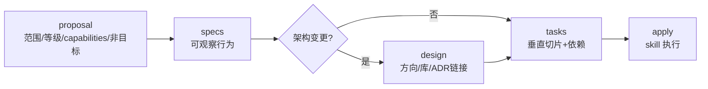

# 同题对比：GPT 与 Claude 回答同一个问题

## 摘要

同一个会话、同一个问题，**GPT-5.6 答一遍，Claude Opus 4.8 再答一遍**。问题是"我想要A，但可以再优化变小，帮我理一理"。

- **GPT 的病灶**：开头先建**四类分类法**要读者记住，结尾追加**三个开放选项**
- **Claude 的做法**：**逐个 artifact 过筛**，每项先给判决再给依据，结尾收敛到**两个决策**
- **字数**：GPT 5754 字，Claude 4829 字
- **用途**：这是 output-style skill 里"判断先行"和"决策点收敛"两条规则的原始证据

---
## GPT-5.6 的回答（5754 字）

先给结论：如果保留 OpenSpec，我认为你现在的 **7 个 planning artifacts 可以缩到 3 个**，同时不丢掉 OpenSpec 最有价值的能力。

## 一、当前为什么显得重

现有依赖链是：

```text
proposal
  ↓
proposal-review
  ↓
specs
  ↓
design
  ↓
implementation-mode
  ↓
tasks
  ↓
execution-plan（多 Agent）
  ↓
apply
```

这里混合了三类东西：

### 1. Change 的长期事实

实现结束后仍有价值：

- 为什么改
- 改哪些外部行为
- 最终采用什么方案
- 怎样拆成可验证切片

### 2. 生成过程中的质量检查

它们是动作，不一定需要独立文件：

- proposal review
- design review
- tasks review
- drift check
- Three Amigos
- library research

### 3. 本次执行会话的临时策略

换个 Agent、Harness 或执行时间就可能变化：

- 当前 worktree
- 是否新建分支
- AI 主导还是人工主导
- 是否使用子代理
- 哪些文件由哪个子代理写
- retry count
- ledger
- review package
- acceptance report

你现在把第 2、3 类也提升成了 OpenSpec artifacts，所以 OpenSpec 从“change 状态骨架”变成了“整个 Agent runtime”。

---

# 二、建议的最小边界：3 个 artifacts

```text
proposal
  ↓
specs
  ↓
plan
  ↓
apply
```

## 1. `proposal.md`：只管 WHY 和边界

建议只保留：

```md
## 问题

为什么当前行为需要改变。

## 预期结果

用户最终能观察到什么变化。

## 范围

这次 change 覆盖什么。

## Capabilities

会新增或修改哪些 capability，用来确定 specs 路径。

## 非目标

明确这次不处理什么。
```

从 proposal 移出：

- GitHub Issue / PR
- worktree 路径
- 分支策略
- 实施模式
- C4/domain/ADR 触发判断
- 默认技术决策
- 详细影响范围
- library 选择
- review report

原因：

- GitHub 链接由 `github-project-flow` 管。
- worktree 是执行环境，不是需求事实。
- C4/domain/ADR 是设计时才知道的。
- 技术决策不属于 proposal。
- review 是生成 proposal 的质量动作，不是独立业务 artifact。

### Proposal Review 怎么办

保留 review，删除 `proposal-review.md`。

流程变成：

```text
生成 proposal 草案
  ↓
调用 reviewer 检查范围、垂直切片、非目标
  ↓
直接修正 proposal
  ↓
review 通过后落盘
```

如果需要审计，只在 proposal 末尾保留极短字段：

```md
## Gate

- 状态：通过
- 未决项：无
```

不再保存一份重复复述 proposal 的 review 文件。

---

## 2. `specs/**/*.md`：保留，这是 OpenSpec 的核心价值

这一层应继续只管 WHAT：

```md
## ADDED Requirements

### Requirement: 用户可以……

#### Scenario: ……
GIVEN …
WHEN …
THEN …
```

保留：

- delta spec
- capability 目录
- Requirement / Scenario
- 外部可观察行为
- archive 时合并到长期 specs

移出：

- Three Amigos 的完整讨论过程
- 用户确认记录
- 源码探索过程
- QA 分析笔记
- reviewer 报告

这些是生成 spec 的方法，不是最终 spec。

最终 spec 只需要留下明确行为，不需要证明 Agent 经过了多少轮讨论。

### 为什么不能再删掉 specs

如果连 specs 也删掉，OpenSpec基本只剩一个复杂的任务文件生成器。此时用 GitHub Issue + tickets 更简单。

所以选择保留 OpenSpec，就应该保留它最独特的能力：

> change delta specs 经 archive 后成为系统长期行为规格。

---

## 3. `plan.md`：合并 design + tasks

这是主要的收缩点。

当前：

```text
design.md
implementation-mode.md
tasks.md
execution-plan.md
```

建议合并成一个长期 `plan.md`，执行期细节移到 `.memory/apply/`。

`plan.md` 建议结构：

```md
## 方案摘要

这次怎样满足 specs，不重复需求内容。

## 关键决策

只记录真正影响实现边界的决定。

## 外部设计引用

- ADR:
- C4:
- CONTEXT:
- Library research:

## 测试 Seam

- 公共入口:
- 可观察结果:
- 不使用的内部验证方式:

## 垂直切片

### 1. 用户可以……

- Spec:
- Blocked By:
- 验收入口:

- [ ] 建立失败验证
- [ ] 完成最小实现
- [ ] 确认行为通过
- [ ] 完成必要同步

### 2. 用户可以……
```

它同时回答两个紧密相关的问题：

- **采用什么实现方向**
- **按什么垂直切片交付**

这里不是把 design 和 tasks 随意糊在一起，而是把它们放进一个有两部分的 artifact：

```text
Solution Contract
        +
Delivery Slices
```

对于普通变更，方案摘要可能只有几段。

对于架构变更，详细内容仍然放在：

- ADR
- C4
- `CONTEXT.md`
- library research

`plan.md` 只引用，不复制。

---

# 三、从 OpenSpec 移出的内容放哪里

## `implementation-mode.md`

删除独立 artifact。

实施模式属于“谁来执行这份 plan”，不是“这份 change 是什么”。

同一个 change 可以：

- 今天由单 Agent 做
- 明天转给人工
- 后天让多个 Agent 接手

改变执行者不应该迫使 planning artifact 失效。

建议在 apply 启动时由 `ai-solo-apply-execution` 决定，并写入：

```text
<changeRoot>/.memory/apply/session.md
```

内容只需：

```md
- Mode:
- Agent strategy:
- Approval points:
- Stop conditions:
```

如果执行会话重开，可以重新选择，不影响 proposal/specs/plan。

---

## `execution-plan.md`

从 OpenSpec artifact 图删除。

只有选择多 Agent 时才生成：

```text
<changeRoot>/.memory/apply/execution-plan.md
```

它是 runtime scheduling plan，不是 change 设计。

包含：

- Work Unit
- file ownership
- read/write scope
- Blocked By
- reviewer
- report path
- memory authority

这样：

```text
plan.md
描述产品切片依赖
```

而：

```text
.memory/apply/execution-plan.md
描述当前这次多 Agent 执行如何调度
```

两者不再混淆。

---

## GitHub 状态

OpenSpec 不再保存完整 GitHub 状态机。

建议关系是：

```text
GitHub Issue
    └─ 指向 OpenSpec change

OpenSpec proposal
    └─ 最多保留 Issue URL 一行，甚至可以不保留

PR
    └─ 指向 Issue + OpenSpec change + verification
```

谁是状态权威：

- change readiness：OpenSpec
- 协作状态：GitHub
- 当前执行状态：`.memory/apply`
- 长期行为：`openspec/specs`
- 长期领域语言：`CONTEXT.md`
- 长期技术决策：ADR

一类信息只有一个权威位置。

---

# 四、缩小后的职责图

```text
OpenSpec
├─ proposal.md       WHY / scope
├─ specs/**/*.md     WHAT / observable behavior
├─ plan.md           HOW summary / delivery slices
└─ archive           promote delta specs

原子 Skills
├─ router                    选择是否进入 OpenSpec
├─ grilling                  消除决策歧义
├─ domain-modeling           维护领域语言
├─ codebase-design           约束技术方案
├─ github-project-flow       Issue / PR
├─ tdd                       测试纪律
├─ code-review               Standards + Spec
├─ black-box-acceptance      用户入口验收
└─ project-context-docs      CONTEXT / ADR promotion

Apply Runtime
└─ .memory/apply/
   ├─ session.md
   ├─ execution-plan.md      仅多 Agent
   ├─ ledger.md
   ├─ reports/
   └─ acceptance/
```

---

# 五、哪些 Gate 还存在

删除 artifact 不等于删除 Gate。

建议保留三个简单 Gate：

## Scope Gate

完成条件：

- proposal 只处理一个可独立交付问题
- 范围与非目标明确
- capabilities 已确定

## Behavior Gate

完成条件：

- 每项外部行为都有 Requirement / Scenario
- 结果可从真实用户或系统边界观察
- 没有实现细节
- proposal 与 specs 无漂移

## Plan Gate

完成条件：

- 方案足以实现全部 specs
- 测试 seam 明确
- 每个 slice 独立可验证
- blocking edges 明确
- ADR/C4/domain 引用完整
- 没有新增范围

Apply 和 Acceptance 不再是 planning artifact Gate，而是执行状态：

```text
planned → applying → verified → archived
```

---

# 六、还有一个更保守的选择

如果你担心 `plan.md` 同时包含 HOW 和 checklist 太混，可以保留四个：

```text
proposal → specs → design → tasks
```

这最接近 OpenSpec 官方默认结构，风险最低。

但我认为对你的个人 solo workflow 来说，**三个 artifacts 更合适**：

```text
proposal → specs → plan
```

原因：

- design 与 tasks 都是从同一组 specs 派生。
- 架构细节已有 ADR/C4 承载。
- 普通变更的独立 design 文件通常过重。
- execution mode 和多 Agent scheduling 已移出。
- plan 内仍能清楚分隔“方案”和“切片”。

我不建议压到两个 artifacts：

```text
change → tasks
```

因为这会把 WHY、WHAT、HOW 混在一起，也失去 OpenSpec 长期 delta specs 的核心价值。

---

## Claude Opus 4.8 的回答（4829 字）

# 一、逐个 artifact 过筛

## 1. proposal — 保留，但砍掉一半内容

现在 `proposal` 的 instruction 塞了：

- 全局写作规则(简体中文、粗体、可读性)
- 提案前探索
- grilling 触发
- 垂直切片拦截
- **Workspace Gate 全过程**(是否新建 worktree、分支名生成、`/move` 指令、会话迁移)
- 变更等级定义
- GitHub 触发
- capabilities 契约
- 默认决策

其中**真正属于 OpenSpec 的只有**：

- 单一问题范围
- 变更等级(它决定后续依赖)
- capabilities 契约(它是 proposal → specs 的连接键)
- 非目标

**应该移走的**：

| 内容 | 移到哪 |
|---|---|
| 全局写作规则 | schema 顶层 `writing rules` 一处，或 `docs/agents` |
| 提案前探索 / grilling | `grilling` skill |
| Workspace Gate 整段 | `using-git-worktrees` skill(它本来就该管这个) |
| GitHub 触发细节 | `github-project-flow` skill(已经有) |

Workspace Gate 是最典型的错位。它是**执行环境准备**，不是 change 的规划状态。它出现在 proposal instruction 里，导致每次写 proposal 都要背一遍 worktree/move 流程。这段应该整体归 `using-git-worktrees`，proposal 里最多留一行“若需隔离，见 using-git-worktrees”。

## 2. proposal-review — 建议删除为独立 artifact

这是我认为**最该砍的一个**。

理由：

- 它是一个 artifact，却只承载“oracle 审了一遍”的结果。
- 它制造了一个额外的 requires 边(`specs` requires `proposal-review`)。
- review 是**执行动作**,不是 change 状态。Matt 的做法就是 review 作为纪律 skill，不作为 artifact。

**替代**：把“proposal 是否聚焦、是否垂直切片、等级是否正确”变成 proposal 自身的一个**完成条件(readiness check)**,由一个 `oracle-review` / `code-review` 类 skill 执行，结果写进 proposal 末尾一小节或 Issue，而不是单独生成 `proposal-review.md`。

这样依赖链从：

```text
proposal → proposal-review → specs
```

变成：

```text
proposal(含 review gate) → specs
```

## 3. specs — 保留，这是 OpenSpec 的核心价值

specs 是唯一**归档后仍长期存在**的 artifact。它就是你“是否需要 OpenSpec”的答案所在：

> 如果你需要长期维护“系统应该怎么表现”,specs + archive 就是 OpenSpec 不可替代的地方。

instruction 里该留的：

- WHAT not HOW
- delta 标题(ADDED/MODIFIED/REMOVED/RENAMED)
- 每能力对应一个 spec 文件
- Gherkin 场景 = 外部可观察行为
- drift check

该移走的：

- Three Amigos 三视角分析 → 这是**方法**,归 `grilling` / 一个 `behavior-analysis` skill
- explorer 子代理只读边界规则 → 归执行 skill

## 4. design — 保留，但改为“条件生成”

现在 design 是 specs 的**强制**后继。这对普通变更是负担。

**关键改动：把 design 变成可选 artifact。**

- 微小维护 / 普通变更且无技术决策 → 跳过 design
- 架构变更 / 有真实库选型或架构取舍 → 生成 design

OpenSpec 支持 artifact 有 `requires`,但是否“每个 change 都必须产出”可以由你的 gate 逻辑控制。让 design 的存在与否取决于变更等级，而不是无条件挡在 specs 和 tasks 中间。

instruction 里该移走的一大块：

- 2-3 候选方案的方法论 → `codebase-design` skill
- 库审批评估维度 → 一个 `library-eval` skill 或并入 design skill
- C4 / domain / ADR 触发细节 → 分别归 `c4-architecture`、`domain-modeling`、`project-context-docs`
- oracle review → review skill

design artifact 本体只需留：**选定方向、批准的库、C4/ADR/domain 的引用链接**。

## 5. implementation-mode — 从 artifact 降级为 apply 的一个参数

这是第二个我强烈建议砍的。

现在它是一个完整 artifact + 完整模板 + 两轮选择工具确认 + requires design + 被 tasks requires。它把一个“执行策略选择”硬做成了规划 artifact。

问题：

- 五种模式的详细定义、风险耗时估算、审批点、并行策略——**全是“怎么执行”**,不是 change 状态。
- 它在 artifact graph 里插了一节点,还卡在 design 和 tasks 之间。

**替代**：模式选择归 `ai-solo-apply-execution` skill 在 apply 入口做一次交互决定,结果记在 apply 的 ledger / handoff,不生成独立规划 artifact。tasks 不再 requires implementation-mode。

依赖链因此再缩一节。

## 6. tasks — 保留，强化依赖图

tasks 是对的,保留。按上一轮结论,给每个切片加 blocking edges 让 frontier 显式化。

instruction 里 TDD 节奏、Three Amigos、oracle review → 移到 `tdd` / review skill。tasks 只留:切片 = 垂直端到端结果、可验证 checklist、slice 间依赖。

## 7. execution-plan — 保留，但移出主 graph

它已经是“仅多 Agent 使用”。问题是它作为 artifact 仍 requires tasks、被 apply 条件依赖。

**建议**:不再作为 OpenSpec artifact,改为 `ai-solo-apply-execution` skill 在多 Agent 模式下于 `.memory/apply/` 生成的执行产物。它本来就全是执行细节(work unit、ledger、review package),没有一样是 change 的长期规划状态。

---

# 二、减法后的依赖图

**现在(7 artifact + apply,5 Gate):**

```text
proposal → proposal-review → specs → design → implementation-mode → tasks → execution-plan → apply
```

**精简后(3 必需 + 1 可选,graph 只剩规划):**



OpenSpec 只管 `proposal → specs → (design?) → tasks` 与 archive。apply、implementation-mode、execution-plan、review、workspace、GitHub 全在 skills。

---

# 三、职责归属总表

| 现在在 OpenSpec 里 | 精简后归属 |
|---|---|
| proposal 范围/等级/capabilities/非目标 | **OpenSpec** |
| specs 可观察行为 + delta | **OpenSpec** |
| design 选定方向/库/ADR链接(可选) | **OpenSpec** |
| tasks 垂直切片 + 依赖 | **OpenSpec** |
| archive / 长期 specs | **OpenSpec** |
| 全局中文写作规则 | schema 顶层一处引用 |
| Workspace / worktree / move | `using-git-worktrees` |
| proposal-review(独立artifact) | 删除 → review skill 的 readiness check |
| Three Amigos 分析 | `grilling` / behavior 分析 skill |
| 候选方案 + 库审批方法论 | `codebase-design` / design skill |
| C4 / domain / ADR 触发流程 | `c4-architecture` / `domain-modeling` / `project-context-docs` |
| implementation-mode(独立artifact) | 删除 → apply skill 入口决策 |
| execution-plan(独立artifact) | 删除 → apply skill 的 `.memory/apply/` 产物 |
| TDD 节奏 | `tdd` skill |
| review severity / 双轴 review | `code-review` skill |
| black-box acceptance | acceptance skill |
| memory promotion | `project-context-docs` |
| GitHub 时机/正文 | `github-project-flow`(已有) |

---

# 四、需要你拍板的两个取舍

其余我可以按上面直接落地,但这两点方向不同、影响 schema 形态,先问你。
