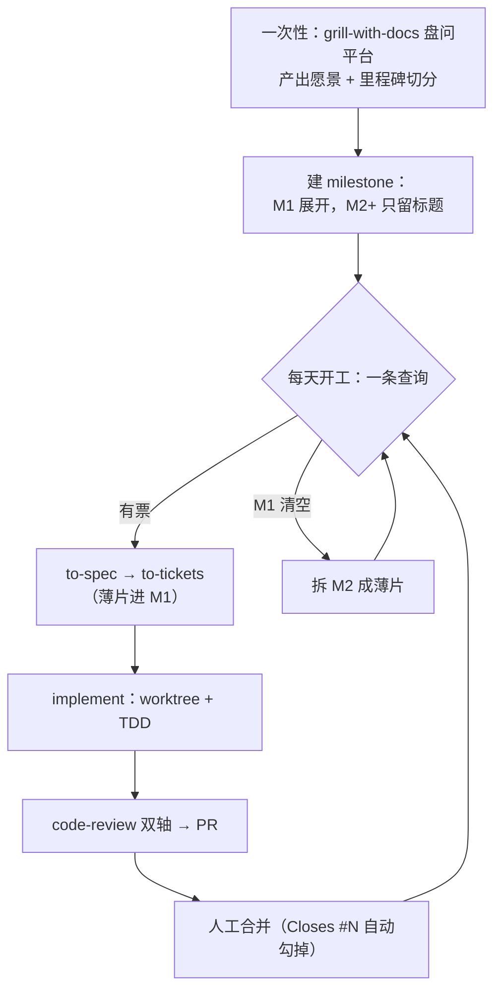

# Workflow KISS 审查（冲刺 DDL 版）

**结论：平台层的三个自建零件全砍——PRD 目录、里程碑维护 skill、wayfinder 的流程位置。里程碑改用 GitHub 原生 milestone，不用置顶 issue 加自造 label。但 grill-with-docs 必须留下当第一步：平台需求在整个仓库里一个字都没有。开发链四环节一环不能再砍，每天开工只剩一条命令。**

范围：唯一目标是一周半内搭完平台，做不完放弃。检验标准是「没有它冲刺会慢吗」，答不上就砍。

依据：已决清单 30 条、`docs/research/` 下 5 份调研、上游 25 个 SKILL.md 原文，以及在本仓库实测过的 `gh` 命令（标「实测」的都在 `lushangkan/lushangkan-workflow` 上跑过）。

---

## 一、砍掉清单

| 砍什么 | 为什么 | 冲刺会慢吗 |
|---|---|---|
| `docs/prd/` 目录和独立的一页愿景 | 愿景和里程碑清单是同一份东西的两节：为什么做 / 分几步走。分两处存就是两处会漂移——这笔税你在 `github-project-flow` 上交过一次（7.7KB 全是桥接双源）。愿景并进 milestone 的 description。 | 不会 |
| 自建的「里程碑清单维护 skill」 | 它要做的三件事都不需要模型判断：取下一张票是一条 `gh` 查询；勾掉薄片是 PR 里写 `Closes #N`；判断里程碑做完是读 milestone 的 `open_issues == 0`（实测 REST 返回这个字段）。这些该写进 AGENTS.md 无条件执行，不该等模型决定要不要触发。 | 不会——三条命令比一个 skill 快 |
| 置顶 issue 当清单，加 `roadmap` label、子 issue 当薄片 | GitHub 有原生 milestone：带进度条、`gh issue list --milestone` 直接筛（实测）、`gh issue create --milestone` 直接归属。自造一套等于把现成功能重写一遍，还得自己维护父子关系。**注意**：`label:"milestone:m1"` 这种带冒号的 label 搜索实测返回 0 条，自造方案连查询都不顺。 | 不会——原生的更快 |
| wayfinder 在流程里的位置（连带「防膨胀刹车」） | 它和滚动式里程碑是同一个问题的两个解：把装不进一个会话的大活摊成 tracker 上可逐条推进的条目。你在问题 10 已选前者，留后者就是两套重叠状态机——你在 OpenSpec 上明确反对过。它还很贵：上游 `ask-matt` 亲口说它是全套里认知负担最重的一条；128 行，带 map/destination/frontier/fog of war/out of scope/HITL-AFK 加 4 种 ticket 类型十来个新词；Matt 自己 3212 人投票只得 25.9%，低于 grill-with-docs 的 32.9%。失败模式对得最准：你调研里 Harshvikram14 一天的活拉成四天、Bryce58831457 模糊项目膨胀到约 60 票丢掉一半想法、marcadx 拆太细要人工合并——三条全是「规划膨胀成项目」，正踩完美主义加软性死线的软肋。 | 不会（重新定位见第五节） |
| `wayfinder:map` 等 label 和 `docs/agents/issue-tracker.md` 的 Wayfinding operations 节 | wayfinder 不进流程就不需要。 | 不会 |
| `Things.md`、`docs/workflow-skills.md` | 前者与 `docs/workflow-ideas-inbox.md` 同内容（md5 不同但正文重复），后者的三层结构和四项待定已被这轮全部推翻。留着让 agent 读到过期规则。 | 不会——反而减少误读 |
| teach、to-questionnaire、wait-what、grill-me、triage、improve-codebase-architecture、prototype、research、wizard、handoff、resolving-merge-conflicts 在冲刺期的位置 | 全量装 25 个已决（Q7），装着不碍事；但**冲刺期一个都不主动调**。teach 按你的指令直接不考虑。 | 不会 |

### 一处不砍：grill-with-docs 必须留

我上一版把它砍了，理由是「已决清单已经把需求盘问完了」。这个理由是错的，纠正：已决清单和 `docs/research/` 描述的是 **workflow 本身**，不是**你要搭的那个平台**。全仓库 grep 下来，平台是什么、给谁用、包含哪些功能，**一个字都没有**——只有「一周半内搭完一个大平台，很紧急」这一句。

所以冲刺第一件事恰恰是盘问平台需求。砍掉它，to-spec 就得凭空编平台功能——这正是你调研里第 4、5 条翻车实录的根因（agent 编造不存在的名字和约定）。**留下，而且是冲刺第一步。**

---

## 二、修改清单

这三项不是砍，是换零件：留住能力，换掉实现。

| 改哪个环节 | 怎么改 | 为什么 |
|---|---|---|
| 里程碑清单的载体 | 从「置顶 issue + `roadmap` label + 子 issue」改成 **GitHub 原生 milestone**。愿景写进 M1 的 description；薄片用 `gh issue create --milestone M1` 直接归属。 | 原生的自带进度条和筛选，`--milestone` 与 `--search` 可同时用（实测）。自造方案还得手工维护父子关系，而且带冒号的 label 搜索实测返回 0 条——连查询都不顺。 |
| 里程碑维护的执行方式 | 从「一个自建 skill」改成 **AGENTS.md 里的三条 `gh` 命令**（领票查询、`Closes #N` 勾票、`open_issues == 0` 判断里程碑完成）。 | 三件事都没有需要模型判断的地方。写成 skill 意味着每次都赌模型会不会触发；写成命令是确定执行。 |
| wayfinder 的定位 | 从「薄片拆不动时的澄清工具」改成 **开局盘问的替代入口**，判据是「一个会话装不下」。详见第五节。 | 它天生产出决策而非交付物（上游原文 decisions, not deliverables），是开局工具。用它拆薄片会踩它最严重的失败模式。 |

---

## 三、保持清单

| 保持什么 | 一句话理由 |
|---|---|
| 开发链四环节（to-spec → to-tickets → implement → code-review） | 每一环砍掉都直接拖慢冲刺，见第四节检验表。 |
| grill-with-docs 作为开局第一步 | 平台需求在仓库里一个字都没有，不盘问就只能让 agent 编。 |
| code-review 双轴隔离 | 你的既有质量底线；Standards 轴不读 spec 才能防 agent 替自己合理化范围漂移。 |
| 上游 25 个 skill 全量装（Q7） | 已决；skill 互相引用，挑装有断链风险，不触发就不碍事。 |
| 滚动式里程碑（M1 展开，M2+ 只留标题） | 已决硬需求，且天然抗方向变更——没拆细就没有过期票要清。 |
| 小票 = GitHub issue（Q6） | 已决；上游 to-spec/to-tickets/code-review 零改造，且异步派活链靠它衔接。 |
| worktree 隔离（D5）、harness 中立（D7 修订） | 已决；与本设计不冲突，milestone 和 issue 都在 GitHub 侧。 |
| 异步基建随余力插入（D3/D4 软性） | 已决为软性；它是加速器不是前置条件，蓝本 cavil-loop/kraken 已选好。 |

---

## 四、修改后的完整流程



### 环节一：一次性开局（冲刺第一天，硬上限当天做完）
`grill-with-docs` 盘问平台：做什么、给谁、边界在哪、分几个里程碑。产出两样东西，都不建新文件：

- **愿景**：3–5 句话，写进 M1 milestone 的 description
- **里程碑切分**：`gh api repos/:owner/:repo/milestones -f title=... -f description=...` 逐个建。**只有 M1 展开成薄片，M2 及以后只有标题加一句目标**（滚动式，已决要求）

### 环节二：每天开工（一条命令，零决策）
```bash
gh issue list --milestone M1 --search "no:assignee" --state open \
  --json number,title --jq '.[0]'
```
（`--milestone` 与 `--search` 同时可用，实测）

返回第一条就领：`gh issue edit N --add-assignee @me`。查询为空说明 M1 做完了（对照 `gh api repos/:owner/:repo/milestones --jq '.[]|select(.title=="M1").open_issues'`，实测有此字段），去拆 M2。

**这一步是整个设计对 ADHD 最重要的地方**：开工不需要读文档、不需要判断优先级、不需要选。一条命令给一张票，直接干。

### 环节三：开发链（四环节，一环都不能砍）
`to-spec` → `to-tickets` → `implement` → `code-review` → PR → 人工合并。

四个环节的存在理由，逐个过检验：

| 环节 | 没有它冲刺会慢吗 |
|---|---|
| to-spec | 会。implement 得自己猜接口和测试范围，返工率高；且 code-review 的 Spec 轴需要一份 spec 才能工作。 |
| to-tickets | 会。它切竖切薄片并标 blocking 边，一片一个上下文窗口——这是 implement 能一次做完的前提。 |
| implement | 会。唯一产出代码的环节。 |
| code-review | 会。平台代码要活一年以上，且双轴隔离是你已决的质量底线。 |

上游 `implement` 内部已经驱动 tdd 和 code-review（15 行原文写死了），所以链上实际只要打两次字。

### 与已决清单的衔接
- 小票 = GitHub issue（Q6 已决）：`gh issue create --milestone M1 --label ready-for-agent`
- blocking 边用 GitHub 原生依赖（实测 `issue_dependencies_summary.blocked_by` 在本仓库返回真值，issue #7 是 2）
- worktree 隔离（D5）、harness 中立（D7 二次修订）都不受影响：milestone 和 issue 是 GitHub 侧的，跟 harness 无关

---

## 五、两个新需求的落地

### 需求 1：方向变更程序
**动作：改。** 不新建文件、不新建 skill，加一条三步程序写进 AGENTS.md：

1. **改愿景**：`gh api --method PATCH repos/:owner/:repo/milestones/<n> -f description=...`，在 description 末尾追加一行 `变更 YYYY-MM-DD：原定 X，改为 Y，因为 Z`
2. **清受影响的票**：未开工的直接关 `gh issue close N --comment "方向变更：<一句话>"`；已开工的当场判断——能改 spec 继续就继续，不能就关掉重开
3. **重拆当前 milestone 的剩余部分**：只拆 M1，M2+ 本来就是模糊的，不用动

**为什么这样**：方向变更的真正风险不是「没记录」，是**下游票已经过期却没人发现**——你调研里 lucidedev 问的正是这个（过期地图不标失效下游票）。第 2 步把这件事变成变更时必做的动作，而不是靠事后发现。滚动式里程碑天然抗这个风险：M2+ 还没拆细，方向变了就没有过期票要清。

**每天的决策成本**：零。这条程序只在方向真的变了才跑，不占日常路径。

### 需求 2：wayfinder 重新定位
**动作：改。** 从「薄片拆不动时的澄清工具」改成「**开局盘问的替代入口，只在一种情况下用**」，并写进 AGENTS.md：

> 平台开局时，如果 `grill-with-docs` 一个会话装不下（盘问到中途上下文就满了，或者里程碑切分明显需要先做几轮调研和原型才能定），换 `wayfinder` 开局：它把开局本身摊成 tracker 上的决策票，一次一张地推。  
> 其他任何时候都不调它——包括薄片拆不动的时候。薄片拆不动是 `to-tickets` 的活（它会让你确认粒度和 blocking 边），或者说明 spec 没写清，回 `to-spec`。

三点理由：

1. **对齐你的原话**（「可以帮定里程碑，也可以帮拆竖切薄片」）里真正有价值的那半：定里程碑。上游 `ask-matt` 写明 wayfinder 产出的是「decisions, not deliverables」，退出时交给 to-spec 收敛——它天生是开局工具，不是拆片工具。你调研里 Alex Keler 唯一那份完整成功复盘也是这个用法（3 小时 wayfinder/grilling 定方向，再转 spec 和 tickets）。
2. **拆薄片交给 wayfinder 会踩它最严重的失败模式**。膨胀（60 票、一天变四天、拆太细）全部发生在拆细粒度的场景。而拆薄片本来就有专门工具：`to-tickets` 的第 4 步会把粒度和 blocking 边拿给你确认，迭代到你点头为止。
3. **有明确的选择条件，所以不占决策成本**。判据是「一个会话装不下吗」——盘问到一半上下文满了就换，是个可观察的事实，不是要权衡的判断。

**冲刺期的实际预期**：大概不会用到。你已经明确「一周半内搭完一个大平台」这个平台你自己心里有数，`grill-with-docs` 一个会话应该问得完。它是保险，不是环节。

---

## 六、这套设计每天要你做几个决定

一个：这张票现在做不做。

- 开工：一条命令给一张票，不选、不排序、不读文档
- 干活：`implement` 内部自己驱动 tdd 和 code-review，你不用决定用哪个纪律
- 收工：PR 写 `Closes #N`，milestone 进度条自己走

方向变更程序和 wayfinder 都不在日常路径上——前者只在方向真变时跑，后者大概整个冲刺都不会用到。
